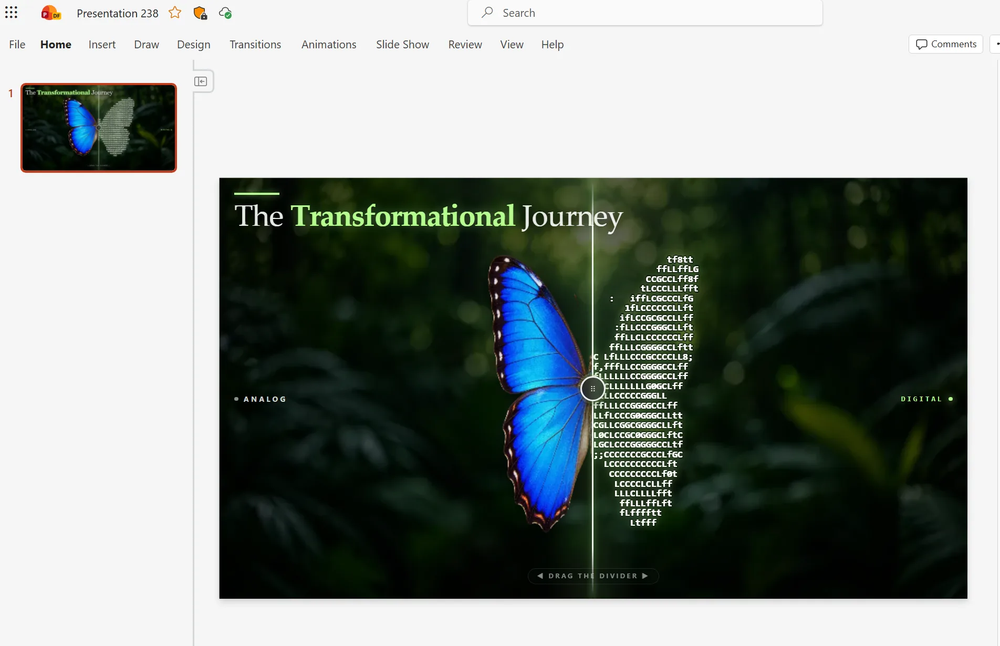

# Interactive Slider: Butterfly Before/After Reveal



## Summary

These prompts create an interactive, full-bleed PowerPoint slide with a draggable before/after slider. The left side presents a photorealistic butterfly and the right side renders the same animated butterfly as live ASCII art, with both versions aligned and moving in lockstep.

Choose **Prompt A** for a concise, implementation-focused request or **Prompt B** for more explicit visual and behavioral guidance.

## Prompt A

```text
Create an interactive, full-bleed slide: a draggable before/after reveal of a butterfly.

Imagery (AI-generated photos, not vector art): a photorealistic butterfly, wings open, straight-on, cut out with transparency; and a heavily blurred green foliage background, no subject.

Composition: edge to edge, no margins. One vertical divider with a small circular drag handle; dragging sweeps between halves. Caption at the bottom of the slide: "◀ Drag the divider ▶". Use the same darkened greenery (~40% brightness) behind both halves so only the butterfly's rendering differs. Left = the photographic butterfly (Analog). Right = the same butterfly, same size and position, re-rendered live as white bold ASCII art with a dark outline and soft glow (Digital).

Animation: wings flap continuously with eased motion plus a gentle bob; both halves animate from the same values so they align across the divider; wings shouldn't collapse too far; the ASCII regenerates each frame so characters reflow.

Sizing: identical scale on both sides; compensate for monospace characters being taller than wide so the ASCII isn't squashed.

Text: heading "The Transformational Journey" with "Transformational" emphasized; labels Analog (left) and Digital (right); nothing else.

Responsiveness: scale to any slide size without clipping or scrollbars.

Keep embedded images compressed to WebP and the total payload under 300 KB. Make the static preview a real render of the finished visual, not a blank placeholder.
```

## Prompt B

```text
Create an interactive, full-bleed slide: a draggable before/after reveal comparing a photographic butterfly with an ASCII-art rendering of the same butterfly.

Composition. Edge-to-edge, no outer margins or black borders. A single vertical divider splits the slide; dragging it left or right sweeps between the two halves. Add a small circular drag handle centered on the divider and a short caption underneath reading "◀ Drag the divider ▶".

Imagery — generate, don't draw. Produce two AI images:
- A single photorealistic butterfly with open wings, shot straight-on, on a plain background so it can be cut out cleanly. Cut it out and keep the transparency.
- A soft, heavily blurred green foliage background — dense out-of-focus leaves, shallow depth of field, no subject.

Do not substitute vector or SVG artwork for either one.

Backgrounds must be identical on both halves. Use the same blurred greenery image, at the same brightness, saturation, and vignette, behind the left and right sides — the two halves should differ only in how the butterfly is rendered. Darken the background substantially on both sides (roughly 40% brightness) so overlaid text stays legible.

Left half — Analog. The photographic butterfly cutout, sharp and full color, sitting over the dark blurred greenery.

Right half — Digital. The exact same butterfly, in the exact same position and at the exact same size, re-rendered live as ASCII art: sample the butterfly's brightness onto a character grid and map it to a density ramp. Render the characters in pure white, bold, with a layered glow — a tight dark outline for separation plus a soft white halo — so they read clearly against the dark background.

Animation. The butterfly's wings flap continuously with smooth eased motion and a gentle vertical bob. The photographic side and the ASCII side must animate in lockstep from the same values, so the two halves always align exactly across the divider. Keep the wings from collapsing too far at the narrowest point of the flap — the silhouette should stay readable throughout the cycle. The ASCII regenerates every frame from the current wing position, so the characters visibly reflow as it flaps.

Sizing. Both halves must render at identical scale — the butterfly must not appear larger or shifted on one side. Account for the fact that monospace characters are taller than they are wide when mapping the image onto the character grid, or the ASCII will come out horizontally squashed.

Text — keep it minimal. Heading: "The Transformational Journey", with "Transformational" emphasized. One label on each half: Analog on the left, Digital on the right. Nothing else — no subtitles, stat lines, or captions beyond the drag hint.

Responsiveness. The whole composition scales to fit any slide size without clipping or scrollbars.
```

## Description

The prompts are designed for Copilot in PowerPoint's interactive slide creation workflow. They specify the generated imagery, draggable slider interaction, synchronized animation, responsive sizing, visual hierarchy, and static preview requirements needed for a polished analog-to-digital transformation concept.

## Use cases

- Show analog-to-digital transformation.
- Create an interactive opening or section slide.
- Demonstrate live rendering or generative visual techniques.
- Add an audience-controlled reveal to a presentation.

## Contributors

[Rolly Seth](https://github.com/rollyseth)

## Version history

| Version | Date | Comments |
| ------- | ---- | -------- |
| 1.0 | September 3, 2026 | Initial release with concise and detailed prompt options. |

## Instructions

1. Open Copilot in PowerPoint.
2. Start an interactive slide creation request.
3. Copy either Prompt A or Prompt B and submit it to Copilot.
4. Review the generated static preview and interactive behavior.
5. Confirm that the divider is draggable, both butterflies remain aligned, the animation loops smoothly, and the slide scales without clipping or scrollbars.

## Prerequisites

- Copilot in PowerPoint with interactive slide creation available.
- AI image generation available in your environment.

## Planned update

An animated GIF or video demonstrating the draggable reveal and butterfly animation will be added in a future update.

## Disclaimer

**THIS CODE IS PROVIDED _AS IS_ WITHOUT WARRANTY OF ANY KIND, EITHER EXPRESS OR IMPLIED, INCLUDING ANY IMPLIED WARRANTIES OF FITNESS FOR A PARTICULAR PURPOSE, MERCHANTABILITY, OR NON-INFRINGEMENT.**
